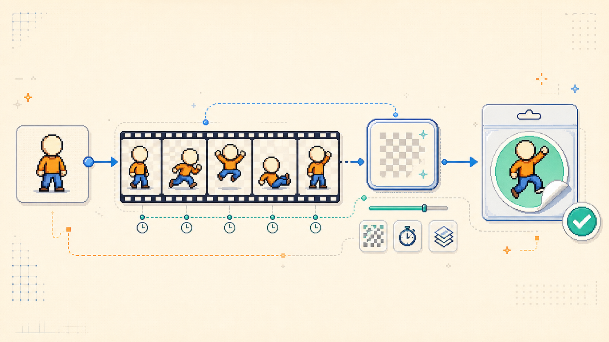

[简体中文](README_CN.md) | English

# Animated Sticker Maker

<p align="center">
  
</p>

[](https://github.com/wufei-png/animated-sticker-maker/actions/workflows/test.yml)
[](https://agentskills.io/specification)
[](LICENSE)

An installable Agent Skill for turning one static reference image and one natural-language motion prompt into one transparent, looping animated sticker.

The Skill keeps creative decisions and deterministic production in one workflow: it derives an identity lock and motion plan, produces the minimum useful anchor poses, builds clean RGBA frames, packages an animated WebP, and records technical and visual validation before delivery.

## What it does

- Preserves the subject's recognizable silhouette, palette, proportions, and fixed marks.
- Plans one clear semantic beat with 4–8 authored keyframes and explicit timing.
- Uses generation only for genuinely new poses, occlusion, or organic deformation.
- Uses deterministic processing for text, transforms, transparency, timing, packaging, and platform exports.
- Supports continuous-tone art and native pixel art without forcing both through the same resampling path.
- Produces a traceable package with normalized source frames, reference metadata, a motion plan, a contact sheet, and validation reports.
- Exports constrained GIF derivatives from validated RGBA sources when a target platform requires them.

## Requirements

- An agent host that supports the [Agent Skills specification](https://agentskills.io/specification).
- A host-native raster image generation or editing capability that can use the reference image and preserve identity.
- Python 3.10 or newer for the deterministic scripts.
- The Python packages listed in [`skills/animated-sticker-maker/requirements.txt`](skills/animated-sticker-maker/requirements.txt).

This repository maintains one portable [`SKILL.md`](skills/animated-sticker-maker/SKILL.md). [`agents/openai.yaml`](skills/animated-sticker-maker/agents/openai.yaml) is optional OpenAI interface metadata; it does not duplicate or redefine the workflow.

## Install

Install interactively from GitHub with the cross-agent `skills` CLI:

```bash
npx skills add wufei-png/animated-sticker-maker
```

For a non-interactive global Codex install:

```bash
npx skills add wufei-png/animated-sticker-maker -g -y --agent codex
```

To inspect the discovered skill before installing:

```bash
npx skills add wufei-png/animated-sticker-maker --list
```

The installable package lives at `skills/animated-sticker-maker/`. No npm package or host-specific second copy is required.

`npx skills add` copies the Skill but does not create a Python environment. Install the deterministic runtime dependencies in the environment used by your agent host:

```bash
python -m pip install "Pillow>=10,<13" "numpy>=1.24"
```

## Invoke

This Skill is deliberately manual-only. Name it explicitly instead of expecting ordinary image or animation requests to trigger it. Hosts that support `agents/openai.yaml` enforce this with `allow_implicit_invocation: false`; on other hosts, the portable Skill description expresses the same intent, but enforcement depends on the host.

```text
Use $animated-sticker-maker with ./character.png.
Make the character nod once and show “Got it!” in a speech bubble, then loop cleanly.
```

Invocation syntax varies by host. On hosts without dollar-sign skill invocation, explicitly ask the host to use the `animated-sticker-maker` skill.

## Output

The default platform-neutral package is:

```text
output/<name>/
├── sticker.webp
├── source/
│   ├── frames/
│   ├── rendered-frames/      # optional validated high-frame track
│   ├── reference.json
│   └── motion.json
├── validation/
│   ├── contact-sheet.png
│   └── report.json
└── exports/                  # created only when requested
    └── <platform>/
```

An artifact is deliverable only when both `technical_validation` and `visual_validation` pass and its report records `deliverable_ready: true`.

## Deterministic tools

The Skill resolves these paths relative to its own `SKILL.md`:

- `scripts/chroma_key.py` — remove a flat work color while preserving clean Alpha edges.
- `scripts/package_sticker.py` — normalize source frames and transactionally build the WebP package and reports.
- `scripts/record_visual_validation.py` — bind maker-side visual validation to the exact artifact fingerprint.
- `scripts/export_platform_gif.py` — create size-constrained GIF and optional preview derivatives.

Platform limits drift. When a platform is named, verify its current official specification and record the source URL and verification date in the export report.

## Local development

```bash
python -m pip install -r skills/animated-sticker-maker/requirements.txt
python -m py_compile skills/animated-sticker-maker/scripts/*.py
python -m unittest discover -s tests -v
```

The test suite exercises packaging, schema validation, Alpha handling, artifact fingerprints, visual-validation invalidation, adaptive GIF export, and failure safety.

## Scope

This repository owns the generic single-sticker workflow. Character identities, pack ordering, release naming, platform account setup, and one-off production logic belong in the project that owns those assets, not in this Skill.

See [`SKILL.md`](skills/animated-sticker-maker/SKILL.md) for the complete agent contract and [`CONTRIBUTING.md`](CONTRIBUTING.md) for contribution guidance.

## License

Apache License 2.0. See [`LICENSE`](LICENSE).
