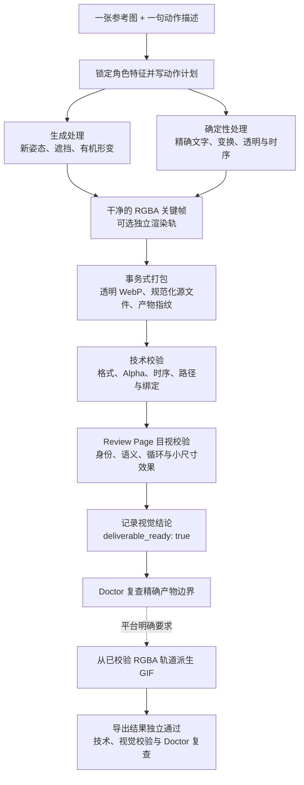

# 做一张能交付的动态表情，难点在生成之后

给模型一张角色图，再说一句“让它点头并显示收到”，现在很快就能得到一段会动的画面。

把它放进表情包，问题才会逐个露出来：角色的脸和轮廓有没有漂，透明边缘是否干净，最重要的姿态停留得够不够久，循环时会不会跳，导出到目标平台后文字还看不看得清。一次生成可以给出素材，却很难回答“这份文件能不能交付”。

Animated Sticker Maker 把这段零散的制作过程整理成一个可安装的 Agent Skill：一份工作流契约，加上可重复执行的确定性脚本。输入一张静态参考图和一句动作描述，它会要求 agent 按约定完成角色约束、动作设计、关键姿态制作、逐帧合成、WebP 打包，以及技术校验与结构化目视判定；精确文字放在确定性图层里控制拼写、位置与时机。最后留下可以复查的源帧、报告，以及交付前用的只读 review page。


## 从输入到可交付文件



## 为什么不把每一帧都交给模型

动态表情里，有些工作适合交给图像生成：新的身体姿态、遮挡关系、衣服和头发的自然形变。另一些工作更适合脚本：文字逐字出现、整体位移、缩放、透明度、逐帧时长、循环参数和文件打包。

逐帧重新生成很容易让主体漂起来，原本稳定的颜色和线条也会闪动。反过来，新姿态全靠脚本拉伸，动作通常很僵。

这个 Skill 会先判断哪些帧真的需要生成，再用确定性处理完成其余部分。动作计划会把这两类工作分开记录，后续返工时能看出某一帧是怎么来的。

## 从哪些开源项目中学到什么

Animated Sticker Maker 的设计有明确的开源参考。早期调研重点看了三条公开路线，其中最直接的架构参考是 OpenAI 的 [`hatch-pet`](https://github.com/openai/skills/tree/main/skills/.curated/hatch-pet)。MiniMax 和美图的方案则更像对照组：它们证明了“照片生成一套动态贴纸”可以做得很短，也帮助我们看清快速出图和可控逐帧生产之间的差别。

| 项目                                                                                                   | 做得好的地方                                                                                                                                  | 对当前设计的影响                                                                                                 | 为什么没有直接采用                                                                                                                                                              |
| ------------------------------------------------------------------------------------------------------ | --------------------------------------------------------------------------------------------------------------------------------------------- | ---------------------------------------------------------------------------------------------------------------- | ------------------------------------------------------------------------------------------------------------------------------------------------------------------------------- |
| OpenAI [`hatch-pet`](https://github.com/openai/skills/tree/main/skills/.curated/hatch-pet)             | 用主参考图锁定角色，再按动作生成素材；精确切帧、透明处理、拼图和校验交给脚本；用 contact sheet 和动画预览发现漂移，失败时只重做有问题的动作。 | 保留身份锁、参考图约束、生成与确定性处理分工、接触表和视觉检查；新姿态只生成最少的锚点，已通过的素材尽量复用。   | 它服务 Codex Pet，动作状态、atlas 几何和 `pet.json` 都有固定协议，文字和独立表情语义也受 Pet 场景限制。普通聊天表情不需要背负这套输出契约。                                     |
| MiniMax [`gif-sticker-maker`](https://github.com/MiniMax-AI/skills/tree/main/skills/gif-sticker-maker) | 输入简单，四张静态贴纸可以并发生成，再分别走 image-to-video 和 GIF 转换；默认动作和多语言字幕让第一次使用很快。                               | 继续把公开输入压到“参考图 + 动作描述”，让 Skill 内部派生制作参数；交付文件保持明确，不要求用户理解底层媒体命令。 | 它固定四张、固定盲盒风格和默认动作，依赖 MiniMax 图片与视频 API，并以白底视频转 GIF 为主。Animated Sticker Maker 更关心透明源帧、逐帧时长可控和循环，不把视频压缩结果当作母版。 |
| 美图 [`meitu-stickers`](https://github.com/meitu/meitu-skills/tree/main/skills/meitu-stickers)         | 支持多种风格和自定义风格，先生成四宫格供用户确认，再拆成四张；需要时才逐张转视频和 GIF，并设计了清晰的失败降级路径。                          | 把创意确认与确定性处理分开，保留每一阶段的文件；平台格式只在确实需要时派生，不提前把所有产物都做一遍。           | 它以四宫格套装和美图 OpenAPI 为中心，动画仍走 image-to-video。当前 Skill 选择一次只处理一张表情，把整包选题、顺序和品牌设定留在素材项目中。                                     |

最终选择这条路线，主要看中返工时的可控性：

- 一次调用只处理一个主体和一个主要语义，整包编排留给所属项目。
- 动画以 4–8 张语义关键帧和逐帧时长为基础，默认总时长约 1.2–2.0 秒，语义最清楚的一帧停留约 400–700 ms；不把视频帧率当作默认生产方式。
- 核心契约不绑定某一家生成 API；host 负责参考图条件下的栅格生成或编辑，脚本负责可重复的后处理。
- RGBA 源帧和透明 WebP 是平台无关母包，GIF 只是目标平台需要时生成的派生文件。
- `technical_validation`、`visual_validation`、产物指纹和事务式打包共同回答“这版能不能交付”，而不只检查文件是否生成成功。其中视觉结论是结构化目视判定，不是自动视觉模型打分。

如果目标就是制作 Codex Pet，直接使用 `hatch-pet` 更合适；如果想快速得到四张特定风格的 GIF，MiniMax 或美图的路径更短。Animated Sticker Maker 面向的是另一种需求：同一个角色要反复迭代多张表情，同时保留逐帧控制、透明母版和可复查的交付记录。

## 一次只做好一张

每次调用处理一个主体、一张表情和一个主要语义。默认流程包括：

1. 从参考图中提取必须保持的轮廓、配色、比例和固定特征。
2. 把一句动作描述拆成 4–8 个关键姿态，明确每帧时长和语义最清楚的停留帧；需要上屏的文字写入确定性图层，而不是逐帧重新生成。
3. 先做最容易暴露问题的关键姿态，确认角色没有漂，再补齐过渡。
4. 构建干净的 RGBA 帧；插画等连续色调默认使用 `1024×1024` 与 `lanczos`，原生像素画保留逻辑画布并用 `nearest`，不强制非整数放大到 1024。
5. 打包循环动画，并重新打开成品检查画布、帧数、时序、循环与 Alpha。
6. 生成接触表；交付前再生成只读 review page，按检查项做结构化目视判定，再把结论写入报告。

默认产物是透明、循环的动态 WebP。只有目标平台明确要求时，才从已校验的 RGBA 源帧生成 GIF，避免从压缩后的 WebP 再转码一次。

## 文件能打开，还不算做完

Animated Sticker Maker 把校验分成两部分：

- `technical_validation` 检查尺寸、格式、帧数、时长、循环、Alpha、文件路径、产物指纹和平台限制。
- `visual_validation` 由 agent 或人对照 review page 与接触表，按固定检查项判定角色是否一致、动作语义是否成立、关键帧是否清楚、实际显示效果是否可接受，再用脚本把结论记入报告。

两项都通过后，报告才会写入 `deliverable_ready: true`。源帧、动作计划或成品只要发生变化，已有视觉结论就会因为产物指纹不匹配而失效，需要重新查看。

打包过程也采用事务式替换。新候选文件会先在临时目录里完成构建和技术校验，通过后才替换已有可用版本；失败的候选会留在单独目录中，不会覆盖上一份正常产物。

## 最后留下什么

一次完整制作会得到下面这组文件：

```text
output/<name>/
├── sticker.webp
├── source/
│   ├── frames/
│   ├── rendered-frames/      # 可选的高帧率轨道
│   ├── reference.json
│   └── motion.json
├── validation/
│   ├── contact-sheet.png
│   └── report.json
└── exports/                  # 仅在需要平台导出时创建
    └── <platform>/
```

最终动图只是其中一个文件。下一次要调节节奏、替换某个姿态或追查颜色闪动，可以直接找到规范化源帧、动作计划、参考图元数据和对应的校验结论。需要分享目视结论时，再从当前报告即时生成 review page；旧页面不作交付快照。

平台导出会另外记录规范来源、核对日期、尺寸与体积限制、调色板选择和文件哈希。平台规则变化后，不必依赖记忆猜测当时用了什么参数。

## 谁会用得上

下面几类任务比较合适：

- 已经有角色、宠物、吉祥物、头像，或需要做成表情的物体与 Logo，希望制作一张动作明确的动态表情。
- 希望多次迭代时仍能保留主体特征，而不是每次从随机结果重新开始。
- 需要透明 WebP、受限 GIF 或可复查的逐帧素材。
- 想让不同 agent host 使用同一份工作流，不维护多套说明。
- 正在制作一整包表情，但愿意把共享设定留在项目中，再逐张调用这个 Skill。

下面几类任务不适合交给这个 Skill：

- 多主体对戏、稳定的多人互动。
- 场景动画或镜头运动。
- 整包自动选题、排序、品牌资产编排和发布排期。

整包选题、角色品牌规范、平台账号申请、发布排期和多场景动画仍由素材所属项目负责。这个 Skill 只处理一张动态表情，并把制作过程留成可复查、可继续修改的交付包。

## 安装和调用

仓库遵循 Agent Skills 目录格式，可以用跨 agent 的 `skills` CLI 安装：

```bash
npx skills add wufei-png/animated-sticker-maker
```

确定性脚本需要 Python 3.10+、Pillow 和 NumPy：

```bash
python -m pip install "Pillow>=10,<13" "numpy>=1.24"
```

这个 Skill 只在被明确点名时运行。例如：

```text
使用 $animated-sticker-maker 处理 ./character.png。
让角色点头一次，并从对话框中显示“收到！”，然后自然循环。
```

不同 host 的调用语法可以不同，不需要为 Codex、Claude Code 或其他 host 维护第二份 `SKILL.md`。host 只要支持 Agent Skills 格式，并提供能结合参考图进行栅格图片生成或编辑的能力，就能读取同一套制作流程。

## 现在能用到什么程度

当前仓库已经包含可用的 Skill、动作与透明处理参考、WebP 打包脚本、review page 与视觉校验记录脚本、受限 GIF 导出脚本和测试。测试覆盖 Alpha、动作 schema、产物指纹、视觉校验失效、GIF 自适应导出和失败安全性，代码以 Apache 2.0 许可开源。

角色要表达什么，仍然需要人来判断，第一版也常常要改。这个 Skill 解决的是另一件事：每一轮修改都有源文件和校验结果可查，不必靠记忆拼回上一次的制作过程。

项目地址：[github.com/wufei-png/animated-sticker-maker](https://github.com/wufei-png/animated-sticker-maker)
